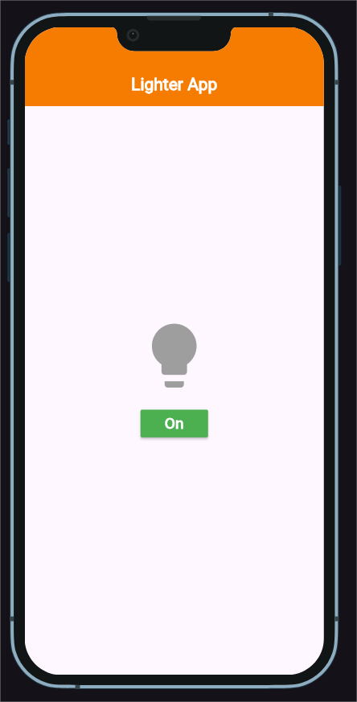
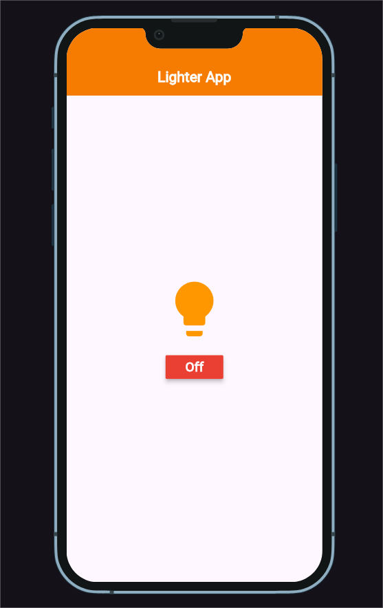

# Lighter App

A simple Flutter app that simulates a lighter with interactive UI.

## ✨ Features

* Realistic lighter animation
* On/Off toggle effect
* Simple and clean design
* Runs smoothly on Android & iOS

## 📸 Screenshots


()

## 🚀 How to Run

1. Clone this repository

   ```bash
   git clone https://github.com/your-username/lighter-app.git
   ```
2. Navigate into the project folder

   ```bash
   cd lighter-app
   ```
3. Get the dependencies

   ```bash
   flutter pub get
   ```
4. Run the app

   ```bash
   flutter run
   ```

## 📱 Platforms Supported

* Android
* iOS

## 🛠️ Tech Used

* Flutter (Dart)
* Material Design

---

Made with ❤️ using Flutter
